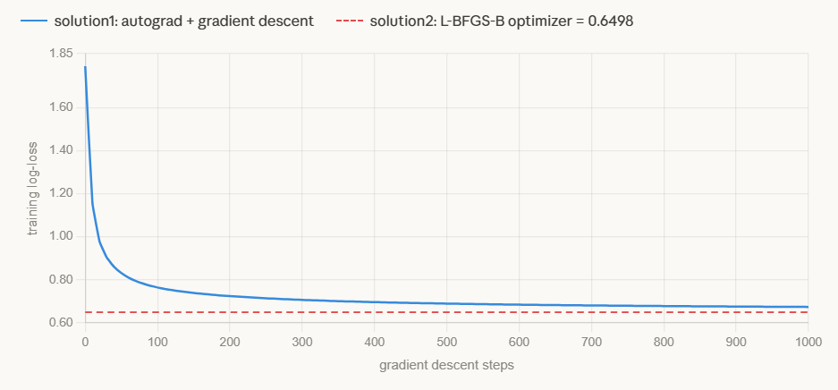
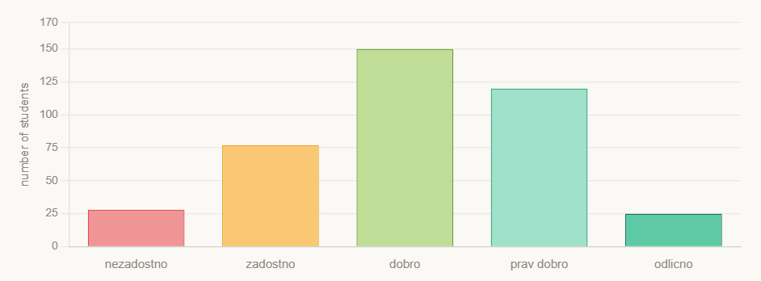

# HW3: Generalized Linear Models

## Part 1: Implementation

### 1.1 Autograd and Gradient Descent (solution1.py)

**Autograd engine.** The core is a `Node` class that wraps a numpy array alongside a `.grad` array of the same shape and a `grad_fn` closure that pushes the output gradient back into each parent node. Primitive operations (`add`, `mul`, `matmul`, `log`, `exp`, `sum_all`, `neg_mean`) each produce a new `Node`, close over their inputs, and register a `grad_fn` implementing the chain rule for that operation. A helper `unbroadcast` reduces gradients back to the original shape when numpy broadcasting has expanded them during the forward pass. Calling `backward()` on the loss builds a topological ordering of the graph by recursively visiting parents before children, then traverses it in reverse, calling each `grad_fn` in turn so that every gradient is fully accumulated before being propagated further.

**Gradient descent** is a plain loop: zero all parameter gradients, call `loss_fn()` to rebuild the graph, call `loss.backward()`, then subtract `lr * grad` from each parameter. The graph is rebuilt from scratch each step.

**Multinomial logistic regression.** The NLL loss is built as a chain of graph nodes: `matmul(X, W) + b` gives logits, a custom log-sum-exp node computes the log-normalizer stably using the row-max trick, subtracting it from the logits gives log-probabilities, masking with the one-hot targets selects the true-class log-probability per sample, and `neg_mean` produces the scalar loss.

**Ordinal logistic regression.** The model is P(y \<= k | x) = sigmoid(threshold\_k - x @ beta). Thresholds are parameterised as t0, t0 + exp(g0), t0 + exp(g0) + exp(g1), ... so that the raw gaps are unconstrained while ordering is always enforced. Because the forward pass involves differencing cumulative probabilities (P(y=k) = P(y\<=k) - P(y\<=k-1)), the entire ordinal loss is expressed as a single custom node with a hand-derived backward pass chaining through the NLL, the differencing, the sigmoid, and finally into beta, t0, and the raw gaps.

**Tests.** The provided `HW2Tests` tests basic shape, probability validity, and row sums. The additional `MyTests` covers: output shape, probabilities summing to one and lying in [0,1], prediction on unseen data, single-sample input, binary classification, separable data accuracy above 75%, correct `classes` attribute, parameters moving away from zero initialization, numerical stability under x1000 feature scaling, all-zero features, and overlapping data with no gradient signal.

### 1.2 Optimization Library (solution2.py)

All parameters are packed into a single flat vector. A scalar NLL function unpacks them, runs the forward pass in numpy, and returns the loss. `fmin_l_bfgs_b` from scipy handles the rest with `approx_grad=True`, estimating gradients numerically via finite differences. L-BFGS-B approximates the loss curvature from past gradient differences, taking large well-directed steps rather than the fixed small steps of gradient descent. The same threshold reparameterisation is used for the ordinal model to keep thresholds ordered.

### 1.3 Comparison

Solution2 finds a strictly better solution. After 1000 gradient descent steps at lr=1.0, solution1 reaches a training NLL of 0.675 while solution2 converges to 0.651, translating to 71.4% vs 73.4% test accuracy and 0.758 vs 0.690 test log-loss. The gap closes slowly with diminishing returns visible from step 200 onward, and gradient descent never reaches solution2's loss within 1000 steps. Solution2 is also more confident. It produces 1493 near-zero probabilities on the test set, whereas solution1 produces none because it has not yet pushed decision boundaries to their optimal positions. Despite this, the two models agree on the predicted class for 90.1% of test samples, with a mean absolute probability difference of 0.031.

The speed difference is counterintuitive: solution1 fits in \~0.5s while solution2 takes \~8-18s despite L-BFGS-B being the superior optimizer. The bottleneck is `approx_grad=True`. Finite-difference gradient estimation requires one extra forward pass per parameter per step. With analytic gradients, solution2 would be the faster implementation. Solution1's speed makes it practical for repeated fitting such as bootstrapping, which is how it is used in this report.

Implementation difficulty strongly favours solution2: defining a scalar loss function and packing parameters is a fraction of the work required to build a full autograd engine with topological sorting, broadcasting-aware gradient accumulation, and a hand-derived ordinal backward pass. Solution2 also needs no hyperparameter tuning. In contrast, solution1's performance depends on choosing a suitable learning rate, which is heavily dataset-dependent.

-----

## Part 2.1: Application of Multinomial Regression

### Setup

The dataset contains 5024 basketball shots from five competitions (NBA, EURO, SLO1, U16, U14). The target is shot type: above head (61%), layup (19%), other (9%), hook shot (8%), dunk (2%), tip-in (1%). Predictors are distance, angle, competition, player type (G/F/C), movement type (no/drive/dribble-or-cut), transition, and whether the shot was two-legged. Categorical features were one-hot encoded with one level dropped per variable to avoid collinearity, and all features were normalized to zero mean and unit variance so that coefficient magnitudes are comparable across features.

The model was fit with solution2 on an 80/20 random split (4020 train, 1004 test). Coefficient uncertainty was estimated via 100 bootstrap resamples using solution1 (lr=1.0, n\_steps=200), each model evaluated on its out-of-bag samples so that the 95% bootstrap CIs reflect generalization performance rather than train performance.

### Predictive Performance

| Model                 | Train Acc | Train Loss | Test Acc | Test Loss | Fit time |
|-----------------------|-----------|------------|----------|-----------|----------|
| Baseline              | 0.608     | 1.792      | 0.608    | 1.792     | 0.00s    |
| Solution 1 (GD)       | 0.731     | 0.724      | 0.714    | 0.758     | 0.51s    |
| Solution 2 (L-BFGS-B) | 0.745     | 0.651      | 0.734    | 0.690     | 18s      |

Both models comfortably beat the baselines. The bootstrap estimate for `solution1` gives accuracy 0.727 [0.703, 0.749] and log-loss 0.740 [0.705, 0.775], consistent with the test set results above.

### Feature–Class Pairs

The table shows the 20 largest individual (feature, class) coefficients by absolute value with 95% bootstrap CIs. All coefficients are relative to the reference class (above head); a positive value means higher feature value increases the log-odds of that class over above head.

| Feature           | Class      | Coef   | 95% CI           |
|-------------------|------------|--------|------------------|
| Distance          | above head | +1.250 | [+1.191, +1.327] |
| Distance          | layup      | -1.141 | [-1.201, -1.074] |
| Movement\_no      | layup      | -0.663 | [-0.711, -0.619] |
| Distance          | other      | +0.541 | [+0.411, +0.637] |
| Movement\_drive   | above head | -0.496 | [-0.518, -0.480] |
| TwoLegged         | other      | -0.472 | [-0.542, -0.394] |
| Distance          | hook shot  | -0.462 | [-0.529, -0.410] |
| Movement\_no      | hook shot  | +0.454 | [+0.410, +0.502] |
| Competition\_U14  | other      | +0.309 | [+0.223, +0.388] |
| Movement\_no      | above head | +0.307 | [+0.211, +0.390] |
| Movement\_drive   | other      | +0.304 | [+0.256, +0.346] |
| Movement\_no      | other      | -0.279 | [-0.359, -0.178] |
| Angle             | layup      | +0.269 | [+0.207, +0.340] |
| Competition\_U14  | hook shot  | -0.266 | [-0.346, -0.198] |
| PlayerType\_G     | hook shot  | -0.254 | [-0.348, -0.177] |
| PlayerType\_G     | other      | +0.235 | [+0.172, +0.301] |
| TwoLegged         | dunk       | +0.217 | [+0.186, +0.247] |
| Movement\_drive   | layup      | +0.216 | [+0.184, +0.247] |
| Competition\_SLO1 | other      | -0.200 | [-0.268, -0.114] |
| Angle             | hook shot  | -0.196 | [-0.265, -0.104] |

### Interpretation

**Distance** is the strongest predictor. Above-head shots are taken from range (+1.25), layups happen close to the basket (-1.14), hook shots are similarly close-range (-0.46), and the "other" category (likely floaters and runners) sits at mid-range (+0.54).

**Movement** is the second-strongest factor. A static position predicts hook shots (+0.45) and above-head jumpers (+0.31), both typically taken from a set stance, while it is strongly negative for layups (-0.66) which almost always involve movement. Drive movement is negative for above-head shots (-0.50) and positive for layups (+0.22) and "other" (+0.30), consistent with drives finishing at the rim or converting into floaters.

**Two-legged jump** is strongly negative for "other" (-0.47), since floaters and runners are one-legged, and positive for dunks (+0.22) and tip-ins (+0.15), which require either explosive vertical power or a stationary rebound tap.

**Angle** is positive for layups (+0.27) and negative for hook shots (-0.20). Layups come from acute angles alongside the basket; hook shots come from more perpendicular post positions.

**Player type** shows guards are underrepresented in hook shots (-0.25) and overrepresented in "other" (+0.24), consistent with guards favouring mid-range floaters over post moves.

**Competition level** shows U14 players are overrepresented in "other" (+0.31) and underrepresented in hook shots (-0.27) and dunks (-0.16), suggesting younger players attempt more improvised shots and lack the technique or athleticism for post moves and dunks. NBA players are more likely to dunk (+0.11).

**Transition** is positive for layups (+0.13) and negative for hook shots (-0.18), consistent with fast breaks finishing at the rim and rarely producing deliberate post play.

### Notes on Interpretation

Coefficients reflect associations in observational data rather than causal effects. For example, distance predicts shot type partly because players choose their shot based on their location. Only coefficients whose 95% CI clearly excludes zero are discussed above.

-----

## Part 2.2: Application of Ordinal Regression

### Data Generating Process

To construct a scenario where ordinal regression outperforms multinomial, the data generating process simulates a Slovenian grading scale ranging from nezadostno (1) to odlicno (5). Students are assigned a latent academic score based on four features: attendance, homework completion, study hours, and physical activity.

We add logistic noise to this score to match the proportional-odds assumption. Four fixed thresholds divide this latent score into the five ordered grades, creating a realistic, bell-shaped distribution. This structure aligns perfectly with the assumptions of the ordinal model. In contrast, multinomial regression overparameterizes the problem by ignoring this inherent ordering.

### Results

Both models were fit using solution1 (lr=0.1, n\_steps=1000) across 25 bootstrap resamples with OOB evaluation. The table reports mean accuracy and log-loss at two sample sizes.

| Model                           | Accuracy at 400 | Log-loss at 400 | Accuracy at 4000 | Log-loss at 4000 |
|---------------------------------|-----------------|-----------------|------------------|------------------|
| Baseline (majority class)       | 0.378           | 1.609           | 0.401            | 1.609            |
| Multinomial logistic regression | 0.434           | 1.280           | 0.453            | 1.267            |
| Ordinal logistic regression     | 0.449           | 1.229           | 0.454            | 1.245            |

At 400 samples, ordinal outperforms multinomial on both accuracy (0.449 vs 0.434) and log-loss (1.229 vs 1.280). The log-loss gap is more pronounced because ordinal's probability distributions are better calibrated. By construction, it cannot assign high probability to a non-adjacent class, whereas multinomial occasionally does so when data is limited. At 4000 samples the models converge to nearly identical performance. This confirms that the advantage is a small-sample phenomenon. Once multinomial has enough data to estimate its extra parameters reliably, the structural constraint of ordinal no longer provides an edge.

### Notes on the DGP

Using logistic noise ensures the ordinal model is correctly specified, keeping the comparison fair. Additionally, grade names include digit prefixes (e.g., 1\_nezadostno) to force alphabetical sorting to match the ordinal sequence.
