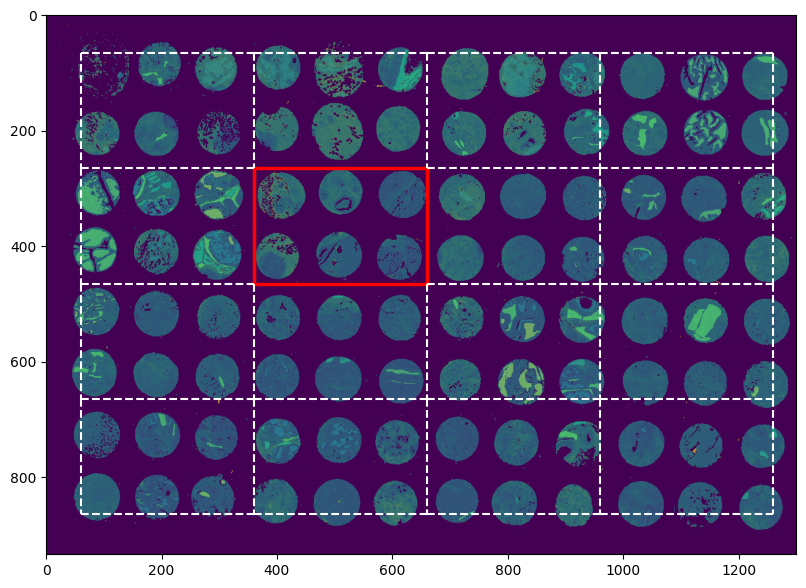

# Model Evaluation Results

Validation uses an anchored `200x300` rectangle grid aligned to the prediction rectangle `data[265:465, 360:660]`. Cells `1, 3, 5, 7, 9, 11, 13, 15` are held out one at a time, and the model trains on the remaining annotated pixels.

Current neural-network settings in `evaluate_models.py`:

| Parameter | Value |
|---|---:|
| Hidden units | `[128, 64]` |
| Activation | ReLU |
| Learning rate | `0.05` |
| Batch size | `512` |
| Regularization | `lambda_=1e-3` |
| Epochs | `5` |
| Coordinate mode | global image coordinates |

## Results

These results were produced by running `evaluate_models.py` with the settings above.

| Model | Features | Avg log loss | Avg accuracy | Pooled log loss | Pooled accuracy | Total time |
|---|---|---:|---:|---:|---:|---:|
| Spectral LR | spectrum | `0.8276 +/- 0.3852` | `0.7271 +/- 0.1643` | `0.8027` | `0.7212` | `39.6s` |
| Spectral NN | spectrum | `0.8603 +/- 0.3377` | `0.7031 +/- 0.1414` | `0.8024` | `0.7234` | `10.7s` |
| Spectral-coordinate NN | spectrum + coordinates | `0.7923 +/- 0.2902` | `0.7271 +/- 0.1547` | `0.7218` | `0.7554` | `10.1s` |
| Local-mean NN | spectrum + 3x3 mean + coordinates | `0.7889 +/- 0.3238` | `0.7344 +/- 0.1777` | `0.6906` | `0.7783` | `13.6s` |
| Multiscale NN | spectrum + 3x3 mean + 5x5 mean + 9x9 mean + coordinates | `0.8737 +/- 0.4979` | `0.7429 +/- 0.1804` | `0.7705` | `0.7814` | `20.7s` |

The best pooled log loss in this run is from the Local-mean NN. The Multiscale NN has slightly higher pooled accuracy, but log loss is the competition metric.

## Tried Changes

- **Validation:** random stratified cross-validation gave overly optimistic scores, so model selection was moved to anchored rectangle validation.
- **Batch size:** larger batches were faster and gave better log loss than small batches.
- **Regularization:** stronger regularization was kept as a more conservative setting for the held-out rectangles.
- **Epochs:** more epochs did not reliably improve rectangle validation, so the script uses a smaller number of epochs.
- **Coordinates:** global image coordinates worked better than rectangle-relative coordinates.
- **Local context:** adding wider local context helped accuracy in some checks but made log loss less stable.
- **NN layers:** different neural-network layer sizes were discussed, including a one-hidden-layer model, but the current `[128, 64]` setup was kept for the main comparison.
- **CNN models:** CNN or patch-based models were discussed as possible improvements because the task has spatial structure, but they were not implemented in the final evaluation script.
- **Ensembles:** probability ensembles were discussed as a possible improvement for log loss, but the current comparison uses single models only.
